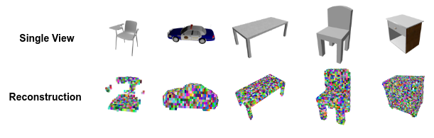

# RecMVCNN - Simultaneous Classification and Reconstruction
3D content can be encoded in many different representations, including point cloud representations, occupancy grids, and meshes. To classify the 3D content, different representations usually require specific classification networks tailored to the respective input data structure. By rendering multi-view images from the 3D representation, this issue can be circumvented and the same network, utilizing the rendered multi-view images as input data, can be used for the task of classification for many different input data structures. A prominent approach that utilizes rendered multi-view images as input data for classification is [MVCNN](http://vis-www.cs.umass.edu/mvcnn/), which serves as a baseline for our method. In this work, we propose RecMVCNN, a lightweight model for classification and shape reconstruction that extends MVCNN with a reconstruction head. Furthermore, experiments regarding the influence of the reconstruction task on the classification task were conducted.

\


Made by Bastian Wittmann, Andrew Desousa, and Florian Donhauser. Project was made for the course "Machine Learning for 3D Geometry (IN2392)" offered at Technical University of Munich in SS2021. The final report can be found in the `docs` directory of this repository.

## Data
This project utilized the ShapeNet dataset. We use the following files from ShapeNet:
- ShapeNet rendering images: http://cvgl.stanford.edu/data2/ShapeNetRendering.tgz
- ShapeNet voxelized models: http://cvgl.stanford.edu/data2/ShapeNetVox32.tgz.

## Environment Variables
To use this project, you must set several envrionment variables beforehand in a `.env` file. Here is an example of what that should look like.
```
SHAPENET_VOXEL_DATASET_PATH="/media/andrew/Storage HDD/data/ShapeNet/ShapeNetVox32"
SHAPENET_RENDERING_DATASET_PATH="/media/andrew/Storage HDD/data/ShapeNet/ShapeNetRendering"
SHAPENET_PC_RENDERING_DATASET_PATH="/media/andrew/Storage HDD/data/ShapeNet/ShapeNetPC"
PROJECT_DIR_PATH="/home/andrew/repos/ML3D-MVCNN"
```
